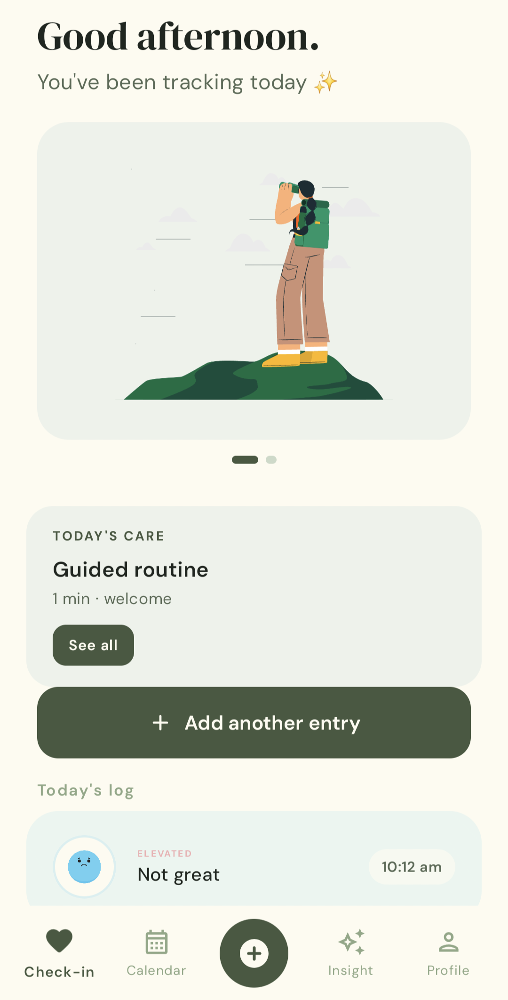
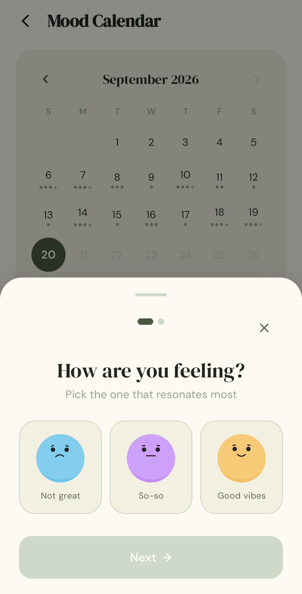
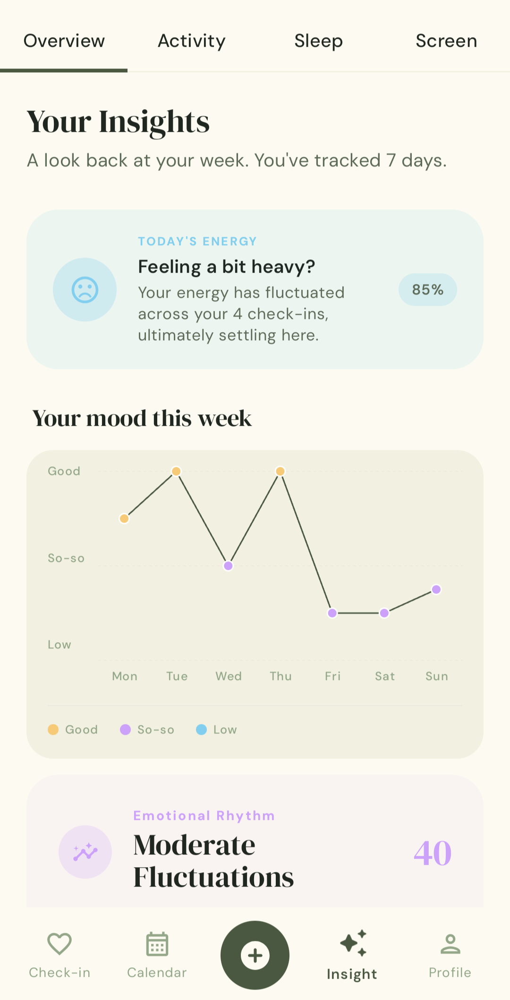
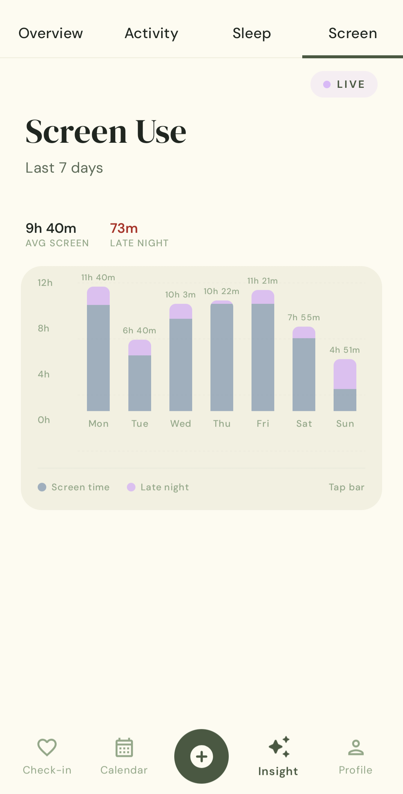
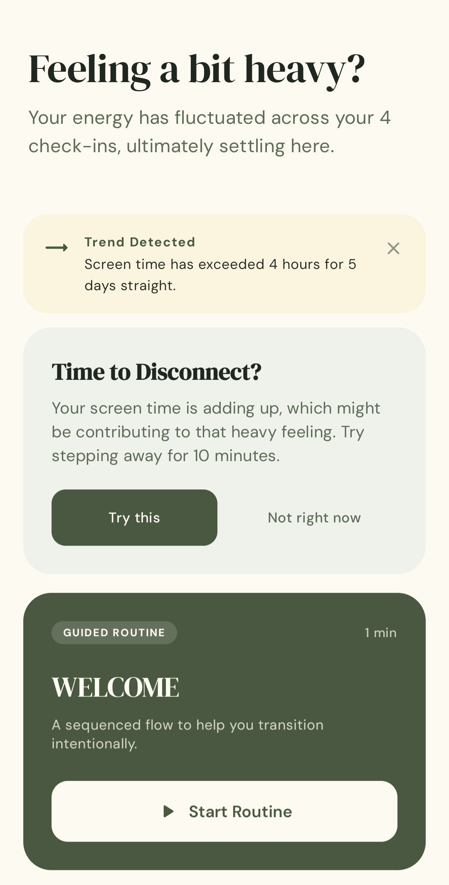
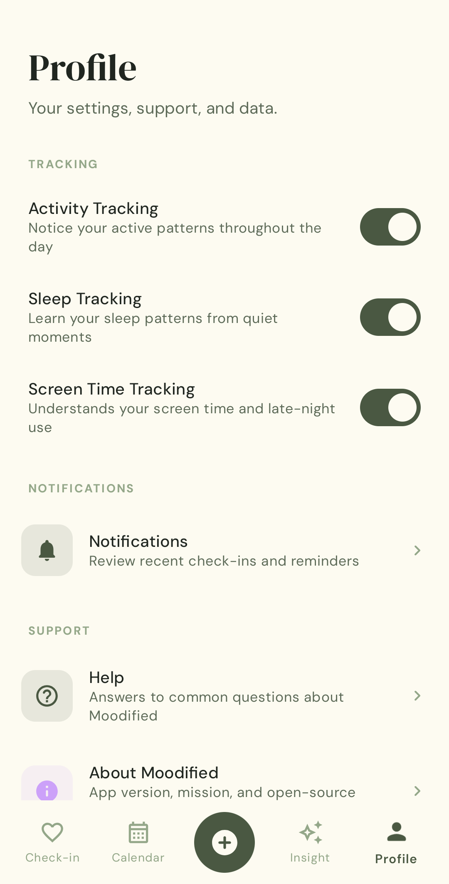

# Moodified

**A quiet companion for your emotional patterns.**

Two-tap mood logging, on-device behavioral context, and adaptive care suggestions — without accounts, servers, or friction.


---

## What it is

Moodified is a native Android app that helps you notice how you feel — in seconds, not sessions. A modal sheet captures your mood in two taps. In the background, with your permission, the app correlates each entry with quiet on-device signals (activity, sleep, screen use) so the picture over a week means something. When the pattern warrants it, an adaptive care engine surfaces a small, matched suggestion.

Everything runs on-device. No accounts, no servers, no telemetry. Nothing leaves your phone unless you export it.

---

## Screens

<table>
  <tr>
    <td align="center"><br/><sub><b>Check-in home</b></sub></td>
    <td align="center"><br/><sub><b>Two-tap quick log</b></sub></td>
    <td align="center"><br/><sub><b>Insight — overview</b></sub></td>
  </tr>
  <tr>
    <td align="center"><br/><sub><b>Insight — weekly</b></sub></td>
    <td align="center"><br/><sub><b>Adaptive care</b></sub></td>
    <td align="center"><br/><sub><b>Profile</b></sub></td>
  </tr>
</table>

<sub>Screenshots pending capture; the frames above render once PNGs land in <code>docs/screenshots/</code>. Frame list: <a href="docs/screenshots/README.md"><code>docs/screenshots/README.md</code></a>.</sub>

---

## Features

- **Two-tap mood logging** — valence, then arousal, then optional note. Deep-linkable via `moodified://quicklog`.
- **Passive behavioral context** — steps, activity intensity, inferred sleep windows, screen interactions. Everything correlated with mood entries.
- **Weekly insights** — mood stability, activity trends, sleep duration/efficiency, screen-time flags including late-night usage.
- **Adaptive care engine** — a transparent rule-based system that reads today's behavioral snapshot and picks a matching intervention (micro-confirmation, guided routine, trend alert, or motivational nudge).
- **Micro-prompt notifications** — occasional gentle check-ins that deep-link straight into the quick-log sheet.
- **On-device by design** — no accounts, no network, no analytics. Data export is JSON to your storage; deletion is one tap.

---

## Tech stack

| Layer | What |
| --- | --- |
| **Language / UI** | Kotlin, Jetpack Compose, Material 3 |
| **DI** | Dagger Hilt |
| **Persistence** | Room (SQLite), DataStore for preferences |
| **Async** | Kotlin Coroutines + Flow |
| **Background** | WorkManager (nightly rollups, retention purges), Foreground Service (tracking) |
| **Motion** | Lottie |
| **Build** | Gradle 9.3, AGP with build-type variants (`debug` / `release`), R8, AAB splits |
| **Quality** | ktlint, detekt, JUnit4, MockK |

---

## Quick start

```bash
git clone https://github.com/mkepg/Moodified.git
cd Moodified
./gradlew installDebug   # installs on a connected device/emulator
```

Debug builds install as `com.moodified.app.debug` — no keystore needed, mock data enabled, side-by-side with any release install. Requires JDK 17, Android Studio (recent stable), and SDK Platform 36.

Full walkthrough — including release builds, common tasks, and troubleshooting — is in [`docs/clone-and-run.md`](docs/clone-and-run.md).

---

## Architecture at a glance

The codebase follows a clean-architecture-lite layering:

```
app/src/main/java/com/moodified/app/
├── core/           # theme, coordination, dev tools, navigation, permissions, background service + workers
├── data/           # Room entities/DAOs, DataStore, exporter, receivers, repository implementations
├── di/             # Hilt modules
├── domain/         # repository interfaces, use cases, model classes
└── presentation/   # Compose screens & viewmodels by feature (check-in, care, insight, calendar, onboarding, …)
```

Debug-only surfaces (mock data seeders, dev navigation) live in `app/src/debug/` and are physically stripped from release builds. See [`docs/application-overview.md`](docs/application-overview.md) for the full architectural walkthrough.

---

## Privacy posture

Moodified is on-device by design. Concretely:

- No accounts, no user identifiers. The app never asks who you are.
- No network calls, no analytics SDKs, no crash reporters. There is no server side.
- Cloud backups and device-transfer are explicitly disabled in the manifest.
- Any data leaves the phone only if you export it from the Privacy screen.
- One-tap "delete all my data" wipes every mood entry, tracking record, and preference.

---

## Documentation

- **[`docs/application-overview.md`](docs/application-overview.md)** — full application overview and technical reference (~550 lines): features, architecture, data layer, inference engines, permissions, build/release, glossary.
- **[`docs/clone-and-run.md`](docs/clone-and-run.md)** — local development setup, build variants, troubleshooting.
- **[`CONTRIBUTING.md`](CONTRIBUTING.md)** — ground rules, style, PR shape.

---

## Status

Moodified is a single-maintainer portfolio project. It's functional end-to-end on Android 8.0+ but not distributed on the Play Store today. Issues and small PRs are welcome; see `CONTRIBUTING.md` before proposing a larger change.

---

## License

Copyright © 2026 Mikhael Edman Gomez. All rights reserved. See [`LICENSE`](LICENSE). The source is public for reference; no permission is granted to redistribute or build derivative products.
